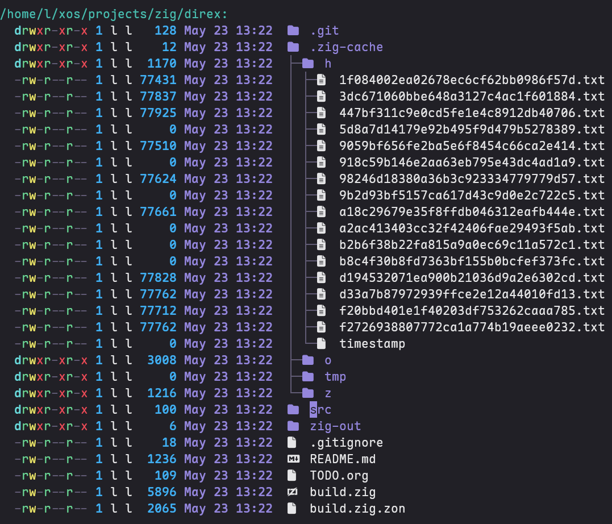

# direx

A standalone terminal file manager in the spirit of Emacs dired, written in Zig.

It lists files the way dired does -- permissions, ownership, size, date, name -- with no dependency on `ls`.
Navigation is keyboard-driven and file opening hands off to `$EDITOR`.

## What it looks like



## Keys

| Key            | Action                 |
|----------------|------------------------|
| `j` `n`  `C-n` | Move down              |
| `k` `p`  `C-p` | Move up                |
| `l` `Enter`    | Open directory or file |
| `h`            | Go up a directory      |
| `g` `M-<`      | Top                    |
| `G` `M->`      | Bottom                 |
| `M-d`          | Kill word              |
| `C-d`          | Delete char            |
| `C-k`          | Kill line              |
| `C-y`          | Yank                   |
| `i`            | Insert mode            |
| `ESC` `C-g`    | Normal mode            |
| `c`            | Execute command        |
| `f`            | Create file            |
| `+`            | Create directory       |
| `d`            | Mark for deletion      |
| `x`            | Execute deletions      |
| `C-/`          | Undo                   |
| `C-?`          | Redo                   |
| `q`            | quit                   |

If you are coming from emacs, I also recommend adding this keybind to your bashrc

```shell
bind -x '"\C-x\C-j": direx'
```

## Configuration

On first run, direx creates `~/.config/direx/config.yaml`. Changes to it take effect immediately, no restart needed.

```yaml
theme:
  directories: "#9587DD"
  datetime:    "#9587DD"
  numbers:     "#41b0f3"
  default_fg:  "#e6e6e8"
  heading:     "#49bdb0"
  privileges:
    d:    "#6bd9db"
    r:    "#6dd797"
    w:    "#eae46a"
    dash: "#615B75"
    exec: "#e84c58"

icons:
  .zig: ""
  .md:  ""
```

Any file extension can be mapped to any Nerd Fonts glyph.

## Building

Build with `zig version` 0.16.0-dev.1456+16fc083f2

```sh
zig build
zig run src/main.zig
```
